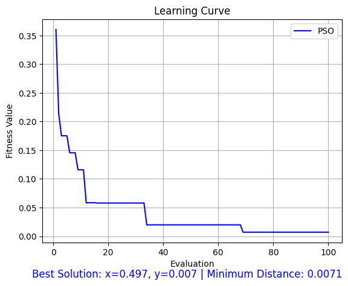
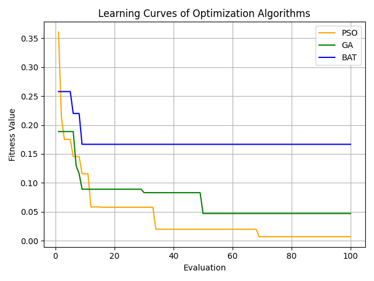

# UR5 Robotiq 85 Grasping Optimization


This project simulates a **UR5 robotic arm** equipped with a **Robotiq 85 gripper** to optimize the grasping of objects placed on a table. We apply three optimization algorithms (**PSO**, **GA**, and **BAT**) to learn the best grasping position `(x, y)`.

## 📈 PSO Learning Curve
<div style="text-align: center;">
  
</div>

## 📊 Comparison of Learning Curves
<div style="text-align: center;">
  <table>
    <tr>
      <th>Algorithm</th>
      <th>Performance</th>
    </tr>
    <tr>
      <td>PSO</td>
      <td>🥇 Best</td>
    </tr>
    <tr>
      <td>GA</td>
      <td>🥈 Second Best</td>
    </tr>
    <tr>
      <td>BAT</td>
      <td>🥉 Worst</td>
    </tr>
  </table>
</div>

<div style="text-align: center;">
  
</div>

The PSO (Particle Swarm Optimization) algorithm shows the fastest convergence and the best performance. GA (Genetic Algorithm) performs moderately well, while BAT (Bat Algorithm) converges slowly and has the worst performance.


---

## 🚀 Features

- Simulates UR5 robot arm and Robotiq 85 gripper using PyBullet physics engine
- Optimizes grasping of small cube-shaped objects
- Supports three optimization algorithms: PSO, GA, and BAT
- Real-time visualization of the training process
- Automatically saves learning curves and best results
- Provides comparison charts of algorithm performance

## 💠 Usage Instructions  

### 1. Setup the Environment  

- Install the required dependencies:  
    ```bash  
    pip install pybullet
    pip install niapy
    pip install numpy
    pip install matplotlib  

### 2. Run the Simulation

- This will initialize the simulation, and the robot will begin performing the object grasping and placement task.
- Run the main optimization script:

    ```bash
    python main_optimization.py
    ```

- Plot the comparison picture using the following command:

    ```bash
    python plot_numpy.py
    ```

### 3. PyBullet GUI

- Once the simulation is running, you can use the PyBullet GUI to observe the robot’s actions in real-time. The interface allows you to track the movement of the robotic arm, gripper, and cubes as they interact within the environment.

---

## 📄 Resources & References

- **PyBullet**: PyBullet is a physics engine for simulating robots and their environments. You can find more details and documentation on the official website of [PyBullet](https://pybullet.org/).
- **NiaPy**: NiaPy (Python Microframework for Building Nature-Inspired Algorithms) is a Python library that provides easy-to-use implementations of various nature-inspired algorithms, such as PSO, GA, and BAT. More information can be found on the [NiaPy GitHub repository](https://github.com/NiaOrg/NiaPy).


